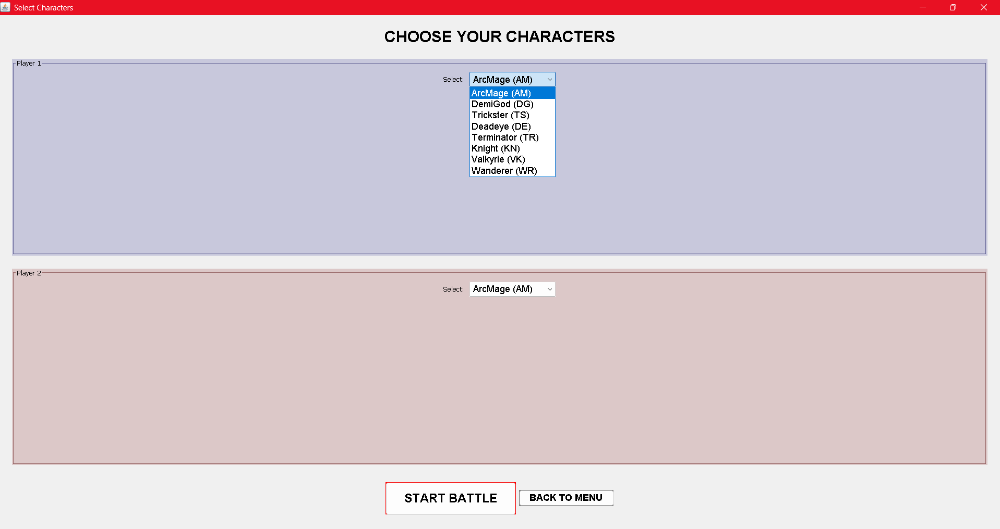
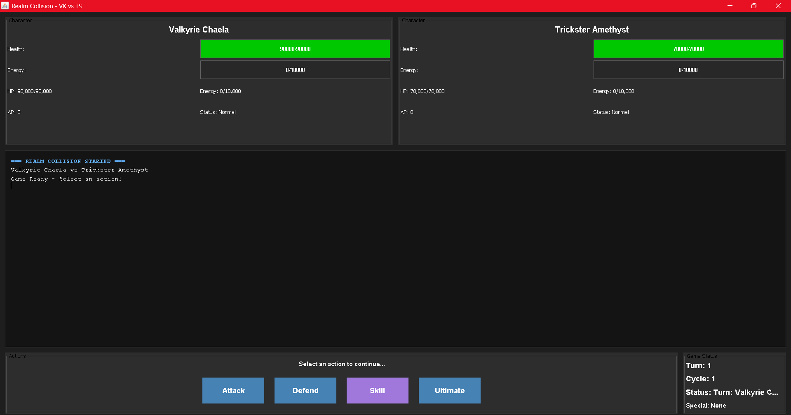

<h1 align = "center">⋆⭒˚.⋆☾.𖥔 ݁ ˖REALM COLLISION 𓂃 ࣪˖ ִֶָ★˖</h1>
<h3 align = "center">⋆༺𓆩Turn-Based ⋆༺𓆩🗡𓆪༻⋆ PVP Game.𓆪༻⋆</h3>
<p align = "center">
<b>CS-2102  </b> <br/>


Andal, Juan Miguel P. <br/>
Soberano, Jonathan G. <br/>
Vitug, Gian Christian V.
</p>

# 🕮 ┊ Overview

Realm Collision is a Turn-based PVP game.<br/>
Choose amongst different acquiantance throughout the entire Cosmos and challenge those who you deemed worthy!


<br/><br/>
The entire Cosmos was built using core Object-Oriented Programming (OOP) principles, including encapsulation, inheritance, polymorphism, and abstraction.

## Features

### 𝄞𝄢 Freedom to:

⚔️ - Play against other Players<br/>
⚖️ - Learn the abilities of each acquaintant<br/>
𓆩✧𓆪 - Engage yourself to the stories behind each characters<br/>

### ⚖️Choose your Acquaintant⚖️:
⚪ ArcMage <br>
⚪ Deadeye <br>
⚪ Knight <br>
⚪ Terminator <br>
⚪ Trickster <br>
⚪ Wanderer <br>


### ⚔️Battle Mechanics⚔️:

⚔️ Attack - Deal damage against your opponent <br/>
🛡️ Defend - Reduce the incoming damage<br/>
🔮 Skill - Unleash the unique ability of your Acquaintant <br/>
✨ Ultimate - A Powerful unique ability that requires amounts of energy


## 🏰 Project Structure🏰:
```
📂 src/
├── 📂 static/
├── 📖 README.md
└── 📂 realmcollision/
    ├── 📂 classes/ 
    │   ├── ⚪ ArcMage.java          
    │   ├── ⚪ Character.java
    │   ├── ⚪ Deadeye.java
    │   ├── ⚪ Knight.java          
    │   ├── ⚪ Terminator.java
    │   ├── ⚪ Trickster.java
    │   └── 📂 Wanderer/
    │       ├── ⚪ Clone.java
    │       └── ⚪ Wanderer.java
    ├── 📂 panels/
    │   ├── 📜 ActionPanel.java          
    │   ├── 📜 BattleLog.java
    │   ├── 📜 CharacterPanel.java
    │   └── 📜 StatusPanel.java
    ├── 📂 utils/   
    │   ├── 🪶 CharacterStats.java          
    │   ├── 🪶 CombatCalculator.java
    │   └── 🪶 CombatUtils.java
    ├── 🎮 GameController.java
    ├── 🖥️ Main.java
    └── 🌌 RealmCollisionGUI.java


📂 static/      - Includes Images required by the 📖 README.md
    
```

### 🌒To Enter the Realm within the Cosmos🌒:
Open your terminal in the `src/` folder and run: {THIS IS A PLACEHOLDER📌}
```
{ADD HOW TO RUN📌}
```
Run the program using:
```
{ADD HOW TO RUN📌}
```

## 💻 Object-oriented Principles💻

### 🪄 Encapsulation
Each character class encapsulates its own data (`health`, `energy`, `action points`) Private fields with public getters/setters Internal state management within each class BattleLog connection through dependency injection

### 🌀 Abstraction
`Character.java` is an abstract base class defining the interface Abstract methods: `attack()`, `defense()`, `castSkill()`, `castUltimate()`. </br> 
Concrete implementations define specific behaviors
UI panels abstract visual representation from game logic


### 🩸 Inheritance
All character classes extend `Character.java` Method overriding for specialized behaviors `Clone.java` extends `Wanderer.java` for shared functionality.
Common utility methods inherited across all characters

### 🎲 Polymorphism
`GameController` treats all characters as Character type Dynamic method dispatch for character-specific actions, 
`castUltimate()` behaves differently per character,
`takeDamage()` has special handling for Wanderer with clones.


## <h2 align = "center"> :･ﾟ✧:･.☽˚｡･ﾟ✧:･.: Sample Output :･ﾟ✧:･.☽˚｡･ﾟ✧:･.: </h2>

Main Menu:

<center></center>
<br>
Acquiantant Selector:
<br> </br>
<center></center>
<br> </br>
The Battlefield:
<br></br>
<center></center>
</br>


##  <h2 align = "center"> ♔♕♗♘♖♙ Contributors ♙♖♘♗♕♔ </h2> 

<table>
<tr>
    <th> Name </th>
    <th> Role </th>
</tr>
<tr>
    <td><strong>Vitug, Gian Christian V. ♔</strong> <br/>
    <a href="https://github.com/avisola" target="_blank">
    
        </a>
    </td>
    <td> Party Leader/Lead Developer</td>
</tr>
<tr>
    <td><strong>Andal, Juan Miguel P. ♗</strong> <br/>
    <a href="https://github.com/JuanMiguelAndal" target="_blank">
    
        </a>
    </td>
    <td>Support/Assistant Developer</td>
</tr>
<tr>
    <td><strong>Soberano, Jonathan G. ♘</strong> <br/>
    <a href="https://github.com/JonasNate987" target="_blank">
    
        </a>
    </td>
    <td>Warrior/Assistant Developer</td>
</tr>
</table>

## 🌸 Acknowledgment 🌸
We extend our heartfelt gratitude to our mentor and course instructor, Ma’am <a href="https://github.com/marieemoiselle" target="_blank">Fatima Marie P. Agdon</a>, whose guidance has been nothing short of enchanting. Her patience and wisdom helped us navigate the challenges of object-oriented programming, turning confusion into clarity and allowing us to grow as aspiring developers. For her support and dedication, we are truly thankful. ❀


